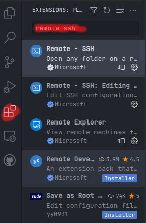
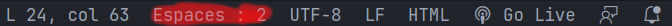
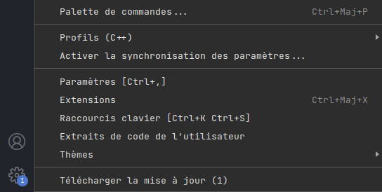
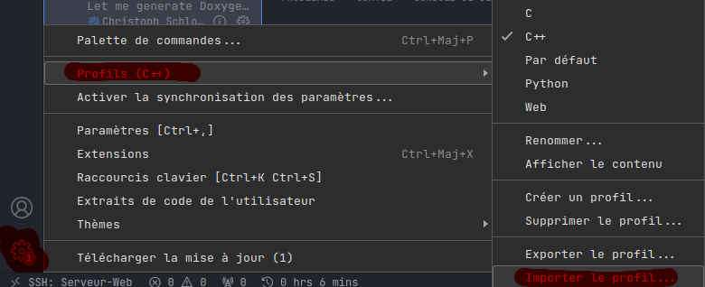

# Faire du backend dans la VM

Pour utiliser Apache, Mysql, ou php il faut configurer votre vm comme un serveur.  
Plusieurs méthodes vous permetteront de coder en php dans cette vm, la première est de coder depuis la machine virtuelle, la deuxième est d'utiliser VsCode et de se connecter à la VM par remote SSH ([tuto](vscode-vm.md)). Ici nous nous concentrons sur la première méthode, mais les instructions sont valables pour la deuxième méthode aussi.  

Dans un premier temps il faudra configurer la vm pour qu'elle devienne un serveur apache, mysql, php (aussi appelé LAMP). Puis dans un second temps installé les extensions nécessaires pour coder en Php.

Pour la première partie je vous recommande de suivre le [tuto](https://doc.ubuntu-fr.org/lamp) d'Ubuntu sur le sujet.

## Extensions Visual Studio code

Pour installer ces extensions, il faudra vous rendre dans l'onglet extension de VsCode:  
  

Puis chercher et installer les extensions:  
- [Php extension pack](https://marketplace.visualstudio.com/items?itemName=xdebug.php-pack)  
- [Thunder client](https://marketplace.visualstudio.com/items?itemName=rangav.vscode-thunder-client)  

## Explication des extensions

[Php extension pack](https://marketplace.visualstudio.com/items?itemName=xdebug.php-pack) contient des snippets (template de code), vérification d'erreurs / syntaxe pour le PHP.  
[Thunder client](https://marketplace.visualstudio.com/items?itemName=rangav.vscode-thunder-client) permet d'envoyer des requêtes customisées à un serveur, pratique pour vérifier le bon fonctionnement d'un serveur pour de l'AJAX.  
  
## Configuration & utilisation des extensions

Une fois les extensions installer, il faudra fermer et réouvrir VsCode, une fois cela fait vous pourrez configurer vos extensions fraîchement installées.  

### Php extension pack

Vous n'avez rien besoin de configurer, normallement tout devrait fonctionner si vous êtes bien dans un fichier php.

### Thunder client

Il n'y a pas vraiment besoin de configuration ici aussi, seulement il faudra apprendre à bien effectuer vos requêtes avec l'extensions. Pour cela je vous recommande de lire la [documentation](https://rangav.medium.com/thunder-client-cli-a-new-way-to-test-apis-inside-vscode-d91eb5c71d8e) du projet.

### Formatter votre code 

Il est important de suivre un style régulier de code dans vos projets, pour ça je vous recommande d'utiliser le formatteur de code intégrer à VsCode. Pour l'utiliser il faut dans un premier temps mettre les espaces à une taille de 2. Puis `ctrl+shift+i` pour formatter votre fichier ou `ctrl+shift+f` pour formatter une sélection.

## Remarques

Si vous utilisé d'autres langages de programmation je vous conseil d'utiliser le système de profil de VsCode (disponbile dans les paramètres, la roue cranté, puis profils). Un profil pour le web est disponbile [ici](../vscode/web.code-profile)  
  

Pour l'importer suffit de cliquer sur importer un profil, et une pop-up vous demande l'url ou le fichier, suffit de sélectionner le bon profil.  
  

### Guides de bonnes pratiques

Pour en apprendre plus sur les bonnes pratiques du PHP, je vous recommande de lire ces guides de bonnes pratiques:

- guide de bonne pratique pour le [PHP](https://phpbestpractices.org/)
