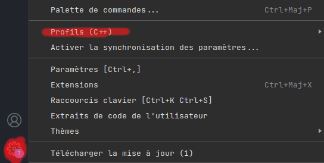

# Faire du backend dans la VM

Pour utiliser Apache, Mysql, ou php il faut configurer votre vm comme un serveur.  
Plusieurs méthodes vous permetteront de coder en php dans cette vm, la première est de coder depuis la machine virtuelle, la deuxième est d'utilisé VsCode et de se connecter à la VM par remote SSH ([tuto](vscode-vm.md). Ici nous nous concentrons sur la première méthode, mais les instructions sont valables pour la deuxième méthode aussi.  

Dans un premier temps il faudra configurer la vm pour devenir un serveur apache, mysql, php (aussi appelé LAMP). Puis dans un second temps installé les extensions nécessaire pour coder en Php.

Pour la première partie je vous recommande de suivre le [tuto](https://doc.ubuntu-fr.org/lamp) de ubuntu sur le sujet.

Quant aux extensions recommandés pour coder du php, il faudra vous rendre dans l'onglet extension de VsCode:
  

Puis chercher et installer les extensions:  
- Php extension pack  
- Thunder client  

Php extension pack contient des snippets, vérification d'erreurs / syntaxe pour le PHP.  
Thunder Client permet d'envoyer des requêtes customisé à un serveur, pratique pour vérifier le bon fonctionnement d'un serveur pour de l'AJAX.  
  
Si vous utilisez d'autres languages de programmation je vous conseil d'utilisez le système de profil de VsCode (disponbile dans les paramètres, la roue cranté, puis profils). Un profil pour le web est disponbile [ici](../vscode/web.code-profile)  
  

Pour l'importer suffit de cliquer sur importer un profil, et une pop-up vous demande l'url ou le fichier, suffit de sélectionner le bon profil.  
  

