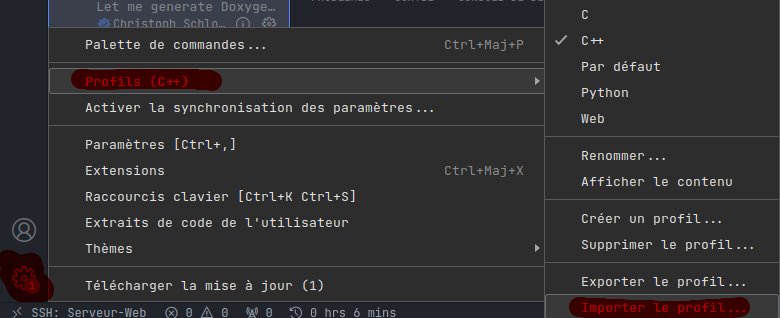

# Coder en C dans la VM
  
Plusieurs méthodes vous permetteront de coder en C dans cette vm, la première est de coder depuis la machine virtuelle, la deuxième est d'utiliser VsCode et de se connecter à la VM par remote SSH ([tuto](vscode-vm.md)). Ici nous nous concentrons sur la première méthode, mais les instructions sont valables pour la deuxième méthode aussi.  

## Outils nécessaires pour le C 

Pour coder en C il vous faudra avoir [Gcc](https://gcc.gnu.org/), [Make](https://www.gnu.org/software/make/), [Gdb](https://www.sourceware.org/gdb/), [Valgrind](https://valgrind.org/) sur votre VM, ainsi que les extensions nécesaires pour votre confort et coder en C.  
  
Pour installer [Gcc](https://gcc.gnu.org/), [Make](https://www.gnu.org/software/make/), [Gdb](https://www.sourceware.org/gdb/), et [Valgrind](https://valgrind.org/) il vous faudra utilisez le terminal de votre VM.  

```bash
sudo apt install gcc make gdb valgrind
```

- [Gcc](https://gcc.gnu.org/) est le compilateur pour le C  
- [Make](https://www.gnu.org/software/make/) est un outil permettant de suivre des instructions de compilations, idéal pour des projets avec plusieurs fichiers interconnectés.  
- [Gdb](https://www.sourceware.org/gdb/) est un débuggueur qui vous permet de voir le contenu de la mémoire en temps réel.  
- [Valgrind](https://valgrind.org/) est un outil permettant de vérifier si des fuites mémoires sont présentes dans votre executable ou non.  

## Extensions Visual Studio Code 

Pour installer ces extensions, il faudra vous rendre dans l'onglet extension de VsCode:  
  

Puis chercher et installer les extensions suivantes:   
- [C/C++ Extension Pack](https://marketplace.visualstudio.com/items?itemName=ms-vscode.cpptools-extension-pack)  
- [Doxygen documentation](https://marketplace.visualstudio.com/items?itemName=cschlosser.doxdocgen)  

## Explication des extensions 

[C/C++ Extension Pack](https://marketplace.visualstudio.com/items?itemName=ms-vscode.cpptools-extension-pack) pack contient des snippets, vérification d'erreurs / syntaxe pour le C/C++.  
[Doxygen documentation](https://marketplace.visualstudio.com/items?itemName=cschlosser.doxdocgen) permet de commenter / documenter vos fonctions, classes avec Doxygen.  

## Remarques

Si vous utilisé d'autres langages de programmation je vous conseil d'utiliser le système de profil de VsCode (disponbile dans les paramètres, la roue cranté, puis profils). Un profil pour le C/C++ est disponbile [ici](../vscode/C-C++.code-profile)  
  

Pour l'importer suffit de cliquer sur importer un profil, et une pop-up vous demande l'url ou le fichier, suffit de sélectionner le bon profil.  
  

