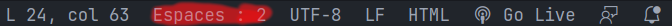

# Faire du frontend dans la VM

Plusieurs méthodes vous permetteront de coder en HTML/CSS/JS dans cette vm, la première est de coder depuis la machine virtuelle, la deuxième est d'utiliser VsCode et de se connecter à la VM par remote SSH ([tuto](vscode-vm.md)). Ici nous nous concentrons sur la première méthode, mais les instructions sont valables pour la deuxième méthode aussi.  
  
Pour faire du html/css/js il faudra juste un navigateur et les bonnes extensions sur VsCode.  

## Extensions Visual Studio code

Pour installer ces extensions, il faudra vous rendre dans l'onglet extension de VsCode:  
  

Puis chercher et installer les extensions:  
- [Live server](https://marketplace.visualstudio.com/items?itemName=ritwickdey.LiveServer)  
- [ESLint](https://marketplace.visualstudio.com/items?itemName=dbaeumer.vscode-eslint)
- [StyleLint](https://marketplace.visualstudio.com/items?itemName=stylelint.vscode-stylelint)
- [HtmlHint](https://marketplace.visualstudio.com/items?itemName=HTMLHint.vscode-htmlhint)

## Explication des extensions

[Live server](https://marketplace.visualstudio.com/items?itemName=ritwickdey.LiveServer) vous permet de faire un serveur web qui hébergera votre page web et ainsi vérifier son bon fonctionnement.  
[ESLint](https://marketplace.visualstudio.com/items?itemName=dbaeumer.vscode-eslint), [StyleLint](https://marketplace.visualstudio.com/items?itemName=stylelint.vscode-stylelint), [HTMLHint](https://marketplace.visualstudio.com/items?itemName=HTMLHint.vscode-htmlhint) qui permet de faire un analyse statique du code, vérifier la syntaxe, les erreurs, les erreurs de logique, failles de sécurités.. Bref un outil indispensable à tout bon développeur.  

## Configuration & utilisation des extensions

Une fois les extensions installer, il faudra fermer et réouvrir VsCode, une fois cela fait vous pourrez configurer vos extensions fraîchement installées.  

### Emmets

L'extension emmets est installée par défaut dans VsCode, et vous permet d'avoir accès à des snippets (template de code) pour l'HTML.  
Dans un fichier html, commencer à écrire `html:5` puis faites entrer, cela vous donnera un début de page HTML.  
De plus il existe aussi un système d'abbréviations afin d'écrire plus rapidemment votre page html, plus d'infos [ici](https://docs.emmet.io/abbreviations/).  

### Live Server

Pour lancer live server, il faudra ouvrir un fichier html et normallement en bas à droite il y aura un logo avec marqué `Go Live`, cliquer sur ce dernier et vous pourrez accéder à votre page web depuis votre navigateur.  


### HtmlHint, StyleLint, ESLint

Ces extensions vous préviendront lorsque vous faites une erreur de syntaxe, ou ne respectez pas une règle de bonne pratique de HTML/CSS/JS.  
StyleLint ne nécessite pas de configuration, mais HTMLHint & ESLint, ont tous deux besoins d'être configuré. Ces deux ont besoin d'être installé dans votre projet, ainsi que de posséder un fichier de configuration propre à chacun (`.eslintrc` pour ESLint, `.htmlhintrc` pour HTMLHint).  

Pour installer ces linters, il faudra exécuter les commandes suivantes dans un terminal et dans le dossier de votre projet.

```bash
sudo apt install npm
npm init -y
npm install eslint eslint-config-airbnb-base eslint eslint-plugin-import htmlhint
```
  
Puis dans le dossier de votre projet, créer & configurer votre `.eslintrc` & `.htmlhintrc`. Si vous ne savez pas comment faire je vous recommande d'utiliser ceux-ci [.eslintrc](../vscode/.eslintrc), [.htmlhintrc](../vscode/.htmlhintrc).

Un script est présent pour ça, aller dans le dossier scripts, puis faites `./install-frontend-linter.sh`.

### Formatter votre code 

Il est important de suivre un style régulier de code dans vos projets, pour ça je vous recommande d'utiliser le formatteur de code intégrer à VsCode. Pour l'utiliser il faut dans un premier temps mettre les espaces à une taille de 2. Puis `ctrl+shift+i` pour formatter votre fichier ou `ctrl+shift+f` pour formatter une sélection.



## Remarques

**Attention** si vous utilisé la 2e méthode ([tuto](vscode-vm.md)) pour coder en HTML/CSS/JS dans la VM, il faudra faire un host pour Apache afin d'avoir accès à votre serveur web, ou ouvrir et redirigé le port de live server.

Si vous utilisé d'autres langages de programmation je vous conseil d'utiliser le système de profil de VsCode (disponbile dans les paramètres, la roue cranté, puis profils). Un profil pour le web est disponbile [ici](../vscode/web.code-profile)  
  

Pour l'importer suffit de cliquer sur importer un profil, et une pop-up vous demande l'url ou le fichier, suffit de sélectionner le bon profil.  
  

### Guides de bonnes pratiques

Pour en apprendre plus sur les bonnes pratiques des langages de front-end, je vous recommande de lire ces guides de bonnes pratiques:

- guide de bonne pratique pour le Javascript fait par [AirBNB](https://github.com/nmussy/javascript-style-guide)
- guide de bonne pratique pour le CSS fait par [AirBNB](https://github.com/mat-u/css-style-guide)
- guide de bonne pratique pour le [HTML](https://html-style-guide.netlify.app/)
