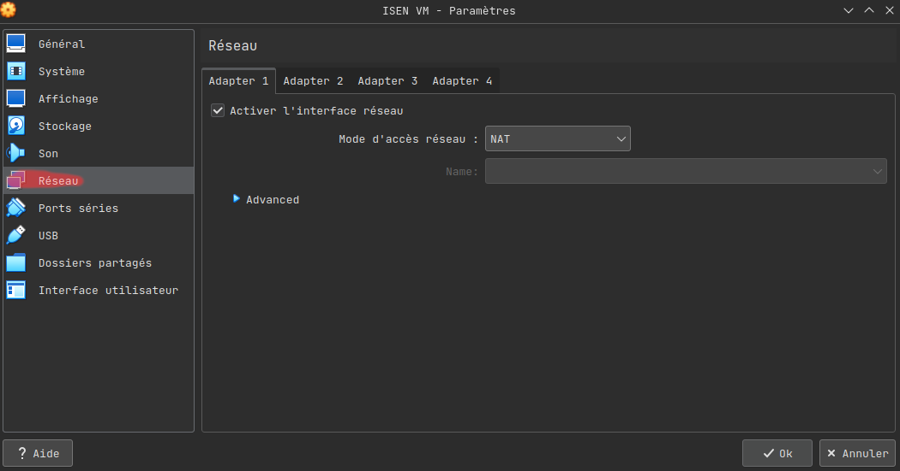

# Configurer Visual Studio Code pour coder dans la VM

Le but de cette configuration est de pouvoir accéder aux outils de votre vm, tout en restant sur le VsCode de votre VM.   
Pour ça on va utiliser l'extension `Remote SSH` de Microsoft.  

Dans un premier temps il faut vérifier que le serveur SSH est bien en route, allumé par défaut, et que le port correspondant soit ouvert.  

Ouvrez `Oracle VM VirtualBox`  
  
  
Cliquez sur la roue cranté Jaune, un menu devrait appraitre, cliquez sur réseau
  
  
Puis ouvrez le sous menu advanced  
  
  
Maintenant cliquez sur le bouton `Redirection de ports`, cela vous ouvrira un menu afin de redirigé les ports de votre VM, vérifiez qu'ils sont bien configurés comme sur le screenshot.  
  
  
Maintenant nos ports sont bien configurés, il faut ouvrir le SSH sur la VM.

Ouvrez un terminal sur la VM puis executez les commandes suivantes:

```bash
sudo systemctl enable ssh.service
sudo systemctl start ssh.service
```

La première ligne dit que le service SSH sera allumé au démarrage de la machine, la deuxième ligne dit qu'on allume le service SSH.  
Maintenant il faut configurer VsCode pour pouvoir se connecter sur la VM. Sur VsCode allez dans l'onglet extension, puis chercher `remote SSH` et installer là.  
  

Une fois l'extension installée en bas à gauche vous devriez avoir quelque chose qui ressemble à "><", cliquez dessus, une fenêtre devrait apparaitre, choisissez `Ajouter un nouvel hôte SSH`.
Puis dans la même fenêtre mettez cette ligne de commande:
```
ssh isen@localhost -p 29200
```

Elle permet de se connecter par SSH à l'utilisateur isen de localhost (ici notre VM) sur le port `29200` (celui par défaut sur le screen pour SSH). Puis un mot de passe vous sera demandé, il s'agit du mot de passe de l'utilisateur isen (par défaut `isen29`).

Et voilà, maintenant vous pouvez installer vos extensions sur la VM depuis l'onglet extension et accéder aux fichiers / terminal de la VM depuis Vscode de votre PC.
