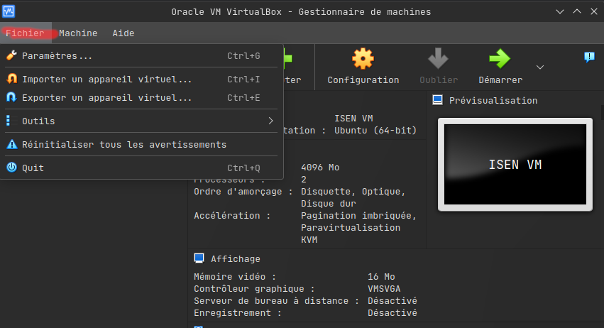

# ISEN VM

Ce repo git contient des aides / scripts pour configurer votre machine virtuelle qui vous sera utile tout le long de votre scolarité à l'ISEN.

## Fonctionnalité par défaut

La machine virtuelle est un Linux [Ubuntu Desktop](https://ubuntu.com/download/desktop).   
Deux éditeurs de texte sont intégrés avec aucune configuration par défaut, [Visual Studio Code](https://code.visualstudio.com/) et [Neovim](https://neovim.io/).  
De plus, la VM possède Git, SSH, Gcc, le combo parfait pour commencer à coder.

## Téléchargement & installation

La machine virtuelle peut être téléchargé [ici](https://drive.google.com/file/d/1EwBesBKyCjHZU2GJmtZNtqWXQQrWqYKA/view?usp=sharing).  
Pour l'installer il vous faudra Oracle VM VirtualBox.  

  
Cliquez sur `Fichier` dans la barre d'outils  

  
Ensuite cliquez sur `Importer un appareil virtuel...`, cela devrait ouvrir une fenêtre contextuelle  

  
Maintenant choisissez l'endroit où vous avez téléchargé la machine virtuelle de l'isen, et ouvrez là, puis cliquez sur suivant.


Vous pouvez modifier le `Machine Base Folder`, c'est l'endroit où votre machine virtuel est enregistré.  
Une fois que c'est bon cliqué sur `Finish`, normallement la machine virtuelle s'importera puis une fois qu'elle sera importé vous pourrez la démarrer en cliquant sur son nom puis la flèche verte démarrer.  

Les identifiants de la VM sont:  
Nom d'utilisateur: `isen`  
Mot de passe: `isen29`  

De plus il est important d'activer la virtualisation dans votre BIOS, pour ça il suffit d'aller dans votre BIOS et de mettre la ligne `virtualisation` sur activé.
[Tuto pour windows](https://support.microsoft.com/fr-fr/windows/activer-la-virtualisation-sur-windows-11-pc-c5578302-6e43-4b4b-a449-8ced115f58e1)

## Ajout supplémentaire

- Coder sur la VM depuis votre machine [avec VsCode](Docu/vscode-vm.md), [avec Neovim]()  
- Coder en C/C++ sur la VM [avec VsCode](Docu/vscode-c.md), [avec Neovim]()  
- Faire du Web Front-End (Html, Css, JS) [avec VsCode](Docu/vscode-frontend.md), [avec Neovim]()  
- Faire du Web Back-End (Apache, Mysql, Php) [avec VsCode](Docu/vscode-backend.md), [avec Neovim]()  
- Faire du python [avec VsCode](Docu/vscode-python.md), [avec Neovim]()

## Mise à jour

La VM est mise à jour tous les ans par le Tech Lab (ce qui implique de devoir réinstaller la VM), ainsi que les scripts, mais il est important d'effectuer les mises à jours de votre machine vous mêmes.  
Pour cela 5 commandes suffisent, ouvrez un terminal et mettez ces commandes:  

```bash
sudo apt update
sudo apt upgrade
sudo apt dist-upgrade
sudo apt autoremove
sudo apt autoclean
```

`sudo apt update` met à jour la liste des dépôts,  
`sudo apt upgrade` met à jour les paquets qui ont une mise à jour disponible,  
`sudo apt dist-upgrade` met à jour le noyau et la distribution,  
`sudo apt autoremove` supprime les paquets obsolètes,  
`sudo apt autoclean` supprime les paquets inutile du cache,  

## Contributions

Toutes contributions des élèves de l'ISEN est la bienvenue, que ce soit pour améliorer les scripts, les explications ou même corriger des fautes.
